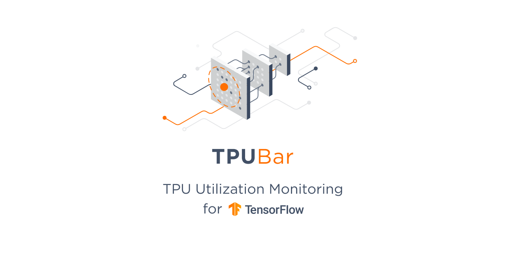
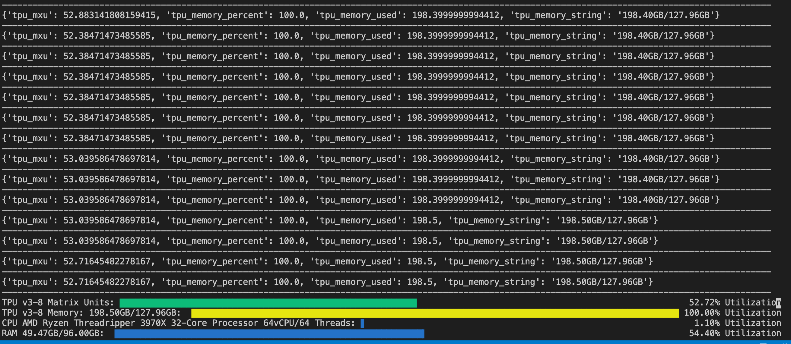

# tpubar
 Google Cloud TPU Utilization Bar for Training Models
 
<p align="center">
    <br>
    
    <br>
<p>


I wouldn't really use this unless you know what you're doing

```shell
pip install --upgrade git+https://github.com/trisongz/tpubar.git
```

## Colab Quickstart

```python3
from google.colab import auth
from tpubar import TPUMonitor
import os

auth.authenticate_user()

monitor = TPUMonitor(tpu_name=os.environ.get('TPU_NAME', None), profiler='v2')

# your training code below
monitor.start()

for x in dataset:
    ops(x)
    print(monitor.current_stats)


```

```python3
from tpubar import TPUMonitor

# if fileout is None, uses sys.stdout
# colors can be defined using standard cli colors or hex (e.g. 'green' or ' #00 ff00')

monitor = TPUMonitor(tpu_name=None, project=None, profiler='v1', refresh_secs=10, fileout=None, verbose=False, disable=False, tpu_util='green', tpu_secondary='yellow', cpu_util='blue', ram_util='blue')

monitor.start()
# Can be called to retrieve stats

stats = monitor.current_stats
# Use stats.get(var, '') to avoid errors since Idle Time and Idle String don't return anything until after full TPU initialization.
tpu_mem = stats.get('tpu_memory_used', '')

```

<p align="center">
    <br>
    
    <br>
<p>

## Notes

There are currently 2 versions of TPUBar, v1 and v2. They each use different API calls to get TPU metrics to avoid compatability issues.

v1 is meant for TPU Projects running on GCE and/or Using Tensorflow < 2. Additionally, v1 can be called on a remote system (like your PC) to query your TPU running on GCE without being directly connected. Not yet tested, but should also be used in Pytorch training as well.

v2 is meant for Colab and/or Tensorflow 2+, and uses tensorflow APIs, which require the system to be directly connected to the TPUs.

They both return different values in current_stats as of right now.

- v1 returns {'tpu_mxu': float, 'tpu_mem_per': float 'tpu_mem_used': float, 'tpu_mem_str': str, 'cpu_util': float, 'ram_util': float, 'ram_util_str': str}
- v2 returns {'tpu_mxu': float, tpu_mxu_str': str, 'tpu_idle_time': float, 'tpu_idle_str': str, 'cpu_util': float, 'ram_util': float, 'ram_util_str': str}


## Contributors

[@shawwn](https://github.com/shawwn)

## Acknowledgements

[Tensorflow Research Cloud](https://www.tensorflow.org/tfrc) for providing TPU Resources